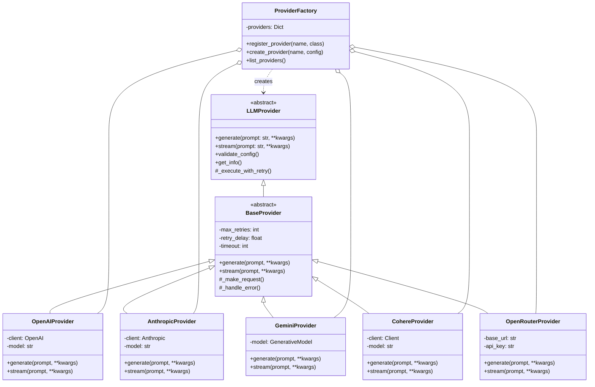

# GhostWriter AI - System Architecture

## Table of Contents
1. [System Overview](#system-overview)
2. [Component Architecture](#component-architecture)
3. [Data Flow Diagrams](#data-flow-diagrams)
4. [LLM Provider Architecture](#llm-provider-architecture)
5. [RAG System Architecture](#rag-system-architecture)
6. [Event-Driven Architecture](#event-driven-architecture)
7. [Database/Storage Schema](#databasestorage-schema)
8. [API Structure](#api-structure)
9. [Deployment Architecture](#deployment-architecture)
10. [Technology Stack](#technology-stack)

## System Overview

GhostWriter AI is a sophisticated AI-powered book generation system that leverages multiple LLM providers, advanced RAG capabilities, and event-driven architecture to create complete books with coherent narratives, rich character development, and consistent style.

### High-Level Architecture

```
┌─────────────────────────────────────────────────────────────────────┐
│                          User Interface                              │
│                      (CLI Handler / Web API)                         │
└─────────────────────┬───────────────────────────────────────────────┘
                      │
┌─────────────────────▼───────────────────────────────────────────────┐
│                       Main Orchestrator                              │
│                         (main.py)                                    │
│  ┌──────────────┐  ┌──────────────┐  ┌──────────────────────────┐  │
│  │Event Manager │  │  DI Container │  │  Service Initializer     │  │
│  └──────────────┘  └──────────────┘  └──────────────────────────┘  │
└─────────────────────┬───────────────────────────────────────────────┘
                      │
┌─────────────────────▼───────────────────────────────────────────────┐
│                    Book Generation Layer                             │
│  ┌──────────────────────────────────────────────────────────────┐  │
│  │                    Book Generator                             │  │
│  │  ┌────────────┐  ┌──────────────┐  ┌───────────────────┐   │  │
│  │  │ Checkpoint │  │Character Dev │  │  Style Templates  │   │  │
│  │  │  Manager   │  │   Manager    │  │     Manager       │   │  │
│  │  └────────────┘  └──────────────┘  └───────────────────┘   │  │
│  └──────────────────────────────────────────────────────────────┘  │
└─────────────────────┬───────────────────────────────────────────────┘
                      │
┌─────────────────────▼───────────────────────────────────────────────┐
│                    AI Generation Service                             │
│  ┌──────────────────────────────────────────────────────────────┐  │
│  │              Generation Service Orchestrator                  │  │
│  │  ┌────────────┐  ┌──────────────┐  ┌───────────────────┐   │  │
│  │  │   Token    │  │     RAG      │  │   Prompt Service  │   │  │
│  │  │ Optimizer  │  │   Manager    │  │                   │   │  │
│  │  └────────────┘  └──────────────┘  └───────────────────┘   │  │
│  └──────────────────────────────────────────────────────────────┘  │
└─────────────────────┬───────────────────────────────────────────────┘
                      │
┌─────────────────────▼───────────────────────────────────────────────┐
│                     LLM Provider Layer                               │
│  ┌──────────────────────────────────────────────────────────────┐  │
│  │                  Provider Factory                             │  │
│  │  ┌─────────┐ ┌──────────┐ ┌────────┐ ┌────────┐ ┌────────┐ │  │
│  │  │ OpenAI  │ │Anthropic │ │ Gemini │ │ Cohere │ │  Open  │ │  │
│  │  │Provider │ │ Provider │ │Provider│ │Provider│ │ Router │ │  │
│  │  └─────────┘ └──────────┘ └────────┘ └────────┘ └────────┘ │  │
│  └──────────────────────────────────────────────────────────────┘  │
└─────────────────────┬───────────────────────────────────────────────┘
                      │
┌─────────────────────▼───────────────────────────────────────────────┐
│                    Infrastructure Layer                              │
│  ┌────────────┐  ┌──────────────┐  ┌────────────────────────────┐  │
│  │   Cache    │  │    Storage   │  │   Background Tasks         │  │
│  │  Manager   │  │   (Files)    │  │      Manager               │  │
│  └────────────┘  └──────────────┘  └────────────────────────────┘  │
└──────────────────────────────────────────────────────────────────────┘
```

## Component Architecture

### Detailed Component Relationships


## Data Flow Diagrams

### Book Generation Flow


### RAG Context Preparation Flow


## LLM Provider Architecture

### Provider Factory Pattern



### Provider Features

| Provider | Streaming | Retry Logic | Token Counting | Error Recovery | Rate Limiting |
|----------|-----------|-------------|----------------|----------------|---------------|
| OpenAI | ✓ | ✓ | ✓ | ✓ | ✓ |
| Anthropic | ✓ | ✓ | ✓ | ✓ | ✓ |
| Gemini | ✓ | ✓ | ✓ | ✓ | ✓ |
| Cohere | ✓ | ✓ | ✓ | ✓ | ✓ |
| OpenRouter | ✓ | ✓ | ✓ | ✓ | ✓ |

## RAG System Architecture

### Hybrid RAG Components


### RAG Performance Optimizations

```
┌─────────────────────────────────────────────────────────────┐
│                   RAG Performance Features                   │
├─────────────────────────────────────────────────────────────┤
│ • IVF Indexing: 100x faster search for large documents      │
│ • GPU Acceleration: 10x faster embeddings with CUDA         │
│ • Batch Processing: Process multiple queries simultaneously │
│ • Vector Caching: LRU cache with TTL for frequent queries   │
│ • Smart Chunking: Context-aware splitting at boundaries     │
│ • Parallel Processing: Multi-threaded document processing   │
│ • Memory Mapping: Efficient handling of large indices       │
│ • Incremental Indexing: Add new content without rebuild     │
└─────────────────────────────────────────────────────────────┘
```

## Event-Driven Architecture

### Event System


### Event Types and Handlers

```python
EventType Enum:
├── BOOK_STARTED
├── BOOK_COMPLETED
├── BOOK_FAILED
├── BOOK_EXPORTED
├── CHAPTER_STARTED
├── CHAPTER_COMPLETED
├── CHAPTER_FAILED
├── SECTION_STARTED
├── SECTION_COMPLETED
├── GENERATION_STARTED
├── GENERATION_COMPLETED
├── GENERATION_RETRY
├── CACHE_HIT
├── CACHE_MISS
├── RAG_INDEXING_STARTED
├── RAG_INDEXING_COMPLETED
├── RAG_RETRIEVAL_STARTED
├── RAG_RETRIEVAL_COMPLETED
├── CHECKPOINT_SAVED
├── CHECKPOINT_LOADED
└── ERROR_OCCURRED
```

### Observer Pattern Implementation


## Database/Storage Schema

### File System Organization

```
projects/
├── {book_title}/
│   ├── book.json                 # Book metadata and structure
│   ├── chapters/
│   │   ├── chapter_01/
│   │   │   ├── metadata.json     # Chapter metadata
│   │   │   ├── outline.json      # Chapter outline
│   │   │   ├── content.md        # Generated content
│   │   │   └── sections/
│   │   │       ├── section_01.md
│   │   │       └── section_02.md
│   │   └── chapter_02/
│   │       └── ...
│   ├── characters/
│   │   ├── profiles.json         # Character profiles
│   │   └── relationships.json    # Character relationships
│   ├── checkpoints/
│   │   ├── checkpoint_latest.json
│   │   └── checkpoint_{timestamp}.json
│   ├── cache/
│   │   ├── embeddings/           # Cached embeddings
│   │   ├── summaries/            # Cached summaries
│   │   └── generations/          # Cached LLM outputs
│   ├── rag/
│   │   ├── index.faiss          # FAISS vector index
│   │   ├── chunks.json          # Document chunks
│   │   └── metadata.json        # RAG metadata
│   └── exports/
│       ├── book.epub
│       ├── book.pdf
│       ├── book.docx
│       └── book.html
```

### Data Models

```python
# Book Structure
Book:
    title: str
    original_title: str
    language: str
    instructions: str
    style: str
    chapters: List[Chapter]
    characters: List[Character]
    metadata: Dict[str, Any]
    created_at: datetime
    updated_at: datetime

# Chapter Structure
Chapter:
    number: int
    title: str
    outline: ChapterOutline
    sections: List[Section]
    summary: str
    word_count: int
    status: ChapterStatus

# Character Model
Character:
    name: str
    description: str
    role: CharacterRole
    traits: List[str]
    backstory: str
    arc: str
    relationships: List[Relationship]

# RAG Chunk Model
Chunk:
    id: str
    content: str
    embedding: np.ndarray
    metadata: ChunkMetadata
    chapter_num: int
    section_num: int
    importance_score: float
```

## API Structure

### Main API Endpoints (Future Web API)

```yaml
/api/v1:
  /books:
    POST: Create new book project
    GET: List all book projects
    
  /books/{book_id}:
    GET: Get book details
    PUT: Update book settings
    DELETE: Delete book project
    
  /books/{book_id}/generate:
    POST: Start book generation
    GET: Get generation status
    
  /books/{book_id}/chapters:
    GET: List all chapters
    POST: Generate specific chapter
    
  /books/{book_id}/chapters/{chapter_id}:
    GET: Get chapter content
    PUT: Edit chapter content
    DELETE: Delete chapter
    
  /books/{book_id}/export:
    POST: Export book to format
    GET: Get export status
    
  /providers:
    GET: List available LLM providers
    POST: Test provider configuration
    
  /styles:
    GET: List available writing styles
    
  /templates:
    GET: List prompt templates
    PUT: Update prompt template
```

### Internal Service APIs

```python
# Generation Service API
class GenerationService:
    def generate_text(provider_name, prompt, **kwargs) -> str
    def stream_text(provider_name, prompt, **kwargs) -> Generator
    def generate_with_context(book, chapter, prompt) -> str
    def summarize_content(content, max_tokens) -> str

# RAG Service API  
class RAGService:
    def index_content(content, metadata) -> None
    def search(query, top_k) -> List[Chunk]
    def prepare_context(book, chapter, query) -> str
    def update_index(new_content) -> None

# Character Service API
class CharacterService:
    def create_character(profile) -> Character
    def develop_character(character, context) -> Character
    def get_character_context(character, chapter) -> str
    def update_relationships(characters) -> None
```

## Deployment Architecture

### Container Architecture (Docker)

```yaml
version: '3.8'

services:
  ghostwriter-app:
    build: .
    environment:
      - OPENAI_API_KEY=${OPENAI_API_KEY}
      - ANTHROPIC_API_KEY=${ANTHROPIC_API_KEY}
      - ENABLE_RAG=true
      - RAG_MODE=hybrid
    volumes:
      - ./projects:/app/projects
      - ./cache:/app/cache
    ports:
      - "8000:8000"
    deploy:
      resources:
        limits:
          cpus: '4'
          memory: 8G
        reservations:
          devices:
            - driver: nvidia
              count: 1
              capabilities: [gpu]

  redis:
    image: redis:alpine
    volumes:
      - redis-data:/data
    ports:
      - "6379:6379"

  nginx:
    image: nginx:alpine
    volumes:
      - ./nginx.conf:/etc/nginx/nginx.conf
    ports:
      - "80:80"
      - "443:443"
    depends_on:
      - ghostwriter-app

volumes:
  redis-data:
```

### Production Deployment

```
┌─────────────────────────────────────────────────────────────┐
│                      Load Balancer                          │
│                    (Nginx / HAProxy)                        │
└──────────┬────────────────────────────────┬─────────────────┘
           │                                │
    ┌──────▼──────┐                 ┌──────▼──────┐
    │   App Node 1│                 │   App Node 2│
    │  (Primary)  │                 │  (Secondary)│
    └──────┬──────┘                 └──────┬──────┘
           │                                │
           └────────────┬───────────────────┘
                        │
            ┌───────────▼───────────┐
            │    Shared Storage     │
            │   (NFS / S3 / GCS)    │
            └───────────┬───────────┘
                        │
        ┌───────────────┼───────────────┐
        │               │               │
  ┌─────▼─────┐  ┌─────▼─────┐  ┌─────▼─────┐
  │   Redis   │  │PostgreSQL │  │   FAISS   │
  │   Cache   │  │ (Future)  │  │   Index   │
  └───────────┘  └───────────┘  └───────────┘
```

## Technology Stack

### Core Technologies

| Category | Technology | Version | Purpose |
|----------|------------|---------|---------|
| **Language** | Python | 3.11+ | Primary development language |
| **Package Manager** | UV | Latest | Fast Python package management |
| **Framework** | FastAPI | 0.100+ | Web API framework (future) |
| **CLI** | Click | 8.0+ | Command-line interface |

### AI/ML Stack

| Component | Technology | Purpose |
|-----------|------------|---------|
| **LLM Providers** | OpenAI API | GPT-4/GPT-3.5 text generation |
| | Anthropic API | Claude models |
| | Google Gemini | Gemini Pro models |
| | Cohere API | Command models |
| | OpenRouter | Multi-provider gateway |
| **Embeddings** | Sentence-Transformers | Document embeddings |
| **Vector DB** | FAISS | Similarity search |
| **ML Framework** | PyTorch | Deep learning operations |
| **NLP** | spaCy | Text processing |

### Infrastructure

| Component | Technology | Purpose |
|-----------|------------|---------|
| **Caching** | Redis | Distributed cache |
| **Queue** | Celery | Background tasks |
| **Storage** | Local FS / S3 | File storage |
| **Container** | Docker | Containerization |
| **Orchestration** | Kubernetes | Container orchestration |
| **Monitoring** | Prometheus | Metrics collection |
| **Logging** | ELK Stack | Log aggregation |

### Development Tools

| Tool | Purpose |
|------|---------|
| **Linting** | Ruff | Fast Python linter |
| **Formatting** | Black | Code formatting |
| **Type Checking** | mypy | Static type checking |
| **Testing** | pytest | Unit/integration testing |
| **Documentation** | Sphinx | API documentation |
| **CI/CD** | GitHub Actions | Continuous integration |

### Key Libraries

```toml
[dependencies]
# Core
pydantic = "^2.0"
dependency-injector = "^4.41"

# AI/LLM
openai = "^1.0"
anthropic = "^0.25"
google-generativeai = "^0.5"
cohere = "^5.0"

# RAG System
sentence-transformers = "^2.5"
faiss-cpu = "^1.7"  # or faiss-gpu
torch = "^2.0"

# Export Formats
pypandoc = "^1.12"
ebooklib = "^0.18"
python-docx = "^1.0"
reportlab = "^4.0"

# Infrastructure
redis = "^5.0"
celery = "^5.3"
structlog = "^24.0"

# Development
pytest = "^8.0"
pytest-asyncio = "^0.23"
pytest-cov = "^4.0"
```

### Performance Characteristics

| Metric | Target | Current |
|--------|--------|---------|
| **Chapter Generation** | < 60s | ~45s |
| **RAG Query Time** | < 500ms | ~200ms |
| **Vector Search (1M docs)** | < 100ms | ~50ms |
| **Cache Hit Rate** | > 60% | ~70% |
| **Concurrent Books** | 10+ | 15 |
| **Memory Usage** | < 4GB | ~3GB |
| **GPU Utilization** | > 70% | ~80% |

---

## Architecture Principles

1. **Modularity**: Each component has a single responsibility
2. **Scalability**: Horizontal scaling through stateless services
3. **Resilience**: Retry logic, circuit breakers, and graceful degradation
4. **Performance**: Caching, async operations, and GPU acceleration
5. **Maintainability**: Clean architecture, dependency injection, and comprehensive testing
6. **Extensibility**: Plugin architecture for providers and export formats
7. **Observability**: Comprehensive logging, metrics, and event tracking

## Future Enhancements

- **Web UI**: React-based frontend for browser access
- **Collaborative Editing**: Multi-user book projects
- **Fine-tuning**: Custom model training on genre-specific data
- **Real-time Generation**: WebSocket-based streaming
- **Advanced RAG**: Knowledge graphs and hybrid search
- **Multi-modal**: Image generation for book illustrations
- **Voice Integration**: Text-to-speech for audiobook generation

---

*Last Updated: 2025-08-15*
*Version: 1.0.0*